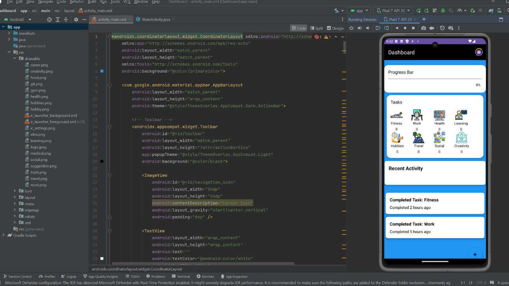

# Task Management Dashboard App

This document explains the layout and design of the **Task Management Dashboard App**, which I developed to help users manage their daily tasks. The dashboard shows task categories, a progress bar for task completion, and recent activities. I designed the app using **Material Design principles** to ensure a user-friendly, responsive interface.

---

## 1. Dashboard Layout Overview

The **dashboard** is the main screen of the app. It includes the following elements:

- **Toolbar**: Displays the app title on the left and a settings icon on the right.
- **RecyclerView**: Displays a list of task categories, each showing:
  - Category name (e.g., Work, Fitness, Personal)
  - An icon representing the category
  - The number of tasks in that category.
- **Progress Bar**: Shows the user's daily task completion percentage.
- **Recent Activity Section**: Displays cards or a list showing the most recently completed tasks.
- **Animated Floating Action Button (FAB)**: Positioned in the lower right corner, it rotates and changes color as it spins, and it’s used for adding new tasks.

---

## 2. Task Categories

The **Task Categories** section displays eight categories, each with an icon and a task count. These categories include:

1. **Fitness** – Icon: A man exercising.
2. **Work** – Icon: A man using a computer.
3. **Health** – Icon: A medical symbol.
4. **Learning** – Icon: A man studying.
5. **Hobbies** – Icon: Drawing or painting tools.
6. **Travel** – Icon: A travel suitcase or globe.
7. **Social** – Icon: Social media symbols.
8. **Creativity** – Icon: An open lightbulb representing creative ideas.

**Screenshot: Task Categories**
> 

---

## 3. Progress Bar

At the top of the screen, a **Progress Bar** dynamically updates to reflect how many tasks have been completed for the day. As tasks are marked complete, the bar fills up, and the percentage increases.

**Screenshot: Progress Bar**
> 

---

## 4. Recent Activity Section

This section shows cards or a list displaying the most **recently completed tasks** or user actions, updating dynamically as tasks are completed.

**Screenshot: Recent Activity**
> 

---

## 5. Animated Floating Action Button (FAB)

I’ve implemented an **animated FAB** in the bottom right corner. When clicked, the button **rotates** and **changes color** as it spins, making it visually appealing and interactive. The FAB is used for adding new tasks.

**Screenshot: Animated Floating Action Button**
> 

---

## 6. User Interaction

- **Tapping a task category** highlights it, indicating it's selected. This prepares the UI for future navigation to category-specific task lists.
- The **Progress Bar** updates dynamically when tasks are added or completed, providing immediate feedback on the user’s progress.
- The **Recent Activity Section** refreshes and reorders itself whenever a new task is completed, showing the most recent activity at the top.

**Screenshot: User Interaction**
> 

---

## 7. Adherence to Material Design Guidelines

The UI adheres to **Material Design** principles in several ways:

1. **Responsiveness**: The app ensures that all elements, such as the toolbar, RecyclerView, and FAB, adjust to different screen sizes and orientations, providing a consistent experience across devices.

2. **Visual Hierarchy**: Key elements like the **Progress Bar**, task categories, and FAB are prominently placed to reflect their importance, ensuring intuitive navigation and interaction for the user.

3. **Consistent Layout and Design**: Each UI component, including icons, cards, and text, follows **Material Design standards**, ensuring visual consistency throughout the app. Shadows, elevations, and padding are used appropriately to make the elements stand out.

4. **Accessible FAB Placement**: The **Floating Action Button** (FAB) is positioned in the bottom right corner for easy reach, and the button’s animation (rotation and color change) follows **Material Design’s motion guidelines**, providing a smooth and engaging user experience.

5. **Dynamic Feedback**: The **Progress Bar** and **Recent Activity Section** provide immediate, real-time feedback when tasks are completed or updated, ensuring the user is always informed of their progress.

6. **Interaction Cues**: Tapping on a task category provides a visual highlight, making it clear which category is selected. This prepares the UI for potential future navigation to detailed task views, following **Material Design’s focus on interaction feedback**.

7. **Use of Cards**: The recent activity section uses **cards**, a core **Material Design** element, to group information in a visually clear, easy-to-digest format. This helps to separate content logically and adds to the aesthetic appeal of the app.

---

## 8. Conclusion

This dashboard provides a clean, functional interface that helps users manage tasks effectively. By following Material Design principles, the app ensures a user-friendly, accessible experience across different devices.

**Screenshot: Dashboard UI**
> 
